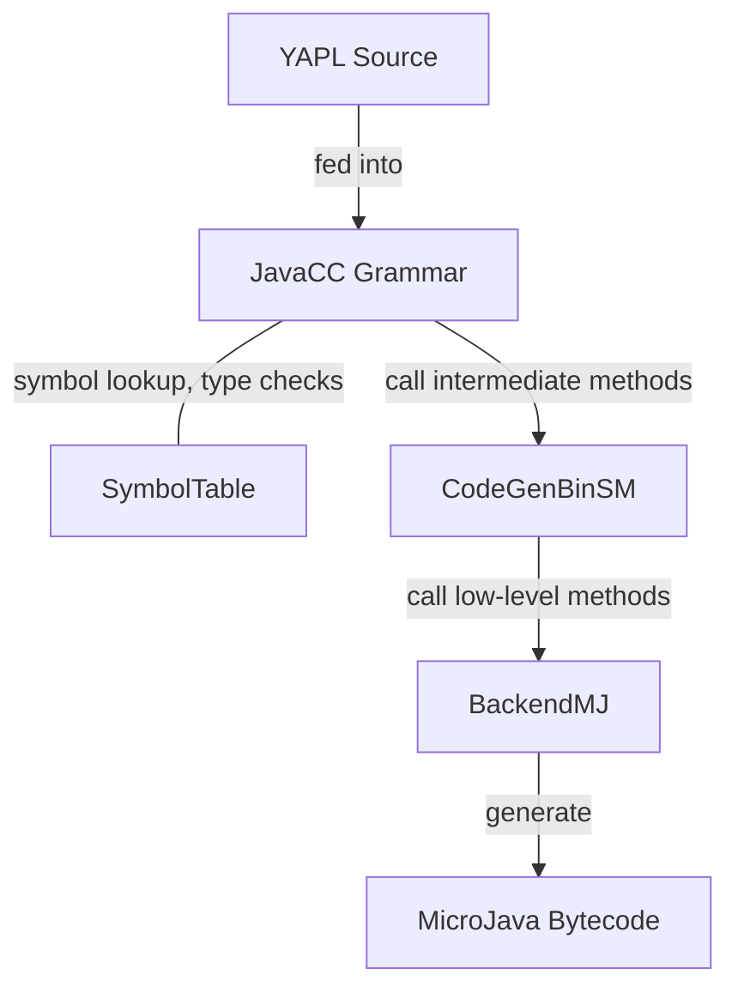

# Compiler Report
Max Jakobitsch

## Structure

The YAPL source is scanned into tokens by the program generated by JavaCC (and jjTree)
from the grammar `Yapl.jjt` given in a form of EBNF, and also including code segments.
The list of tokens is parsed by expanding the `Program` production,
which expands further productions until the input is fully parsed,
or an error occurs.

In productions, a symbol table (`yapl.impl.SymbolTable`) is used to store
and lookup symbols (variables, constants, procedures), their types (for type checking)
and offsets (for loading and storing values).

Code is generated by calling methods from `yapl.impl.CodeGenBinSM`
which in turn call lower level methods in `yapl.impl.BackendMJ`
which add instructions and data to the MicroJava output.

The output bytecode resembles P-code in structure as would be expected for a stack machine.

## Functional Issues

### 2. Internal data type representation

Primitive types are static references to instances of `yapl.lib.Type`,
accessed via static fields of `Type`.
(the constructor of `Type` is package-private)
Arrays are represented by `yapl.lib.ArrayType`, which extends `Type`
and includes the number of dimensions the array has and its base type
(for `int[][]`, `dim` is 2 and `baseType` is `Type.INT`).
Records are represented by `yapl.lib.RecordType`, which also extends `Type`
and includes the type's name and a list of symbols that represent its fields.

Type checking is performed in the `Assignment` production in `src/yapl/compiler/Yapl.jjt`.
There the types of the LHS (`lvalue`) and the value-to-be-assigned (`expr`)
are checked for compatiblity using `equals`.
Another example are return statements,
where the return type of the active procedure (`proc`) is compared to
the type of the value that is being returned (`x`).
Exceptions that need to be checked for, are procedures that return void,
including the main "procedure".

Compatibility is checked using the `equals` method.
For primitive types this just means comparing with `==`,
since all references to, for example, the `int` type are equal.
For simple checks (like "is this an array type?")
`Type` provides convenience helper methods.

### 4. Code generation for expressions

The main philosophy of the implementation is "everything is on the stack".
For expressions in particular, this means that as soon as a production returns,
its result value is the top value on the stack.
This allows for very straightforward methods in `CodeGen`.
Only in some cases, immediate values are not appropriate,
but these cases are easily isolated and dealt with separately.
(one example for such a case would be selectors)

In terms of memory usage on the expression stack,
each kind of expression has low requirements,
with the notable exception of procedure calls
(if they count as expressions)
as their memory usage can be arbitrarily high.
However, long expressions may use memory proportional
to the syntax tree depth, as operands remain on the stack
until the operation can be finished.

### 5. Selector expressions / dereferencing

Evaluating record and array selectors is handled by the `Selector` production.

First, if the value of the preceding element
(`parent`, from which values are to be selected)
is not already on the stack, it is loaded.  
Then, depending on the kind of selector:

- for arrays: the index is loaded onto the stack
  and the `Attrib` is marked as `ArrayElement`.
- for records: the `Attrib`'s offset is set to the
  field offset of the selected field and
  the `Attrib` is marked as `RecordField`.

These two steps are repeated in case of consecutive selectors,
as `Selector` may be followed by another selector.
Thus, the result of `Selector` is either `Attrib.ArrayElement` or `Attrib.RecordField`.

Finally, once the topmost `Selector` returns, depending on the parent production,
the resulting reference is either dereferenced (in case of `PrimaryExpression`),
or kept on the stack until it is needed (in case of `Assignment`).

### 7. Predefined procedures

Predefined functions' signatures are defined in the enum `yapl.impl.PredefinedFunction`.

They are included into the symbol table (`yapl.impl.SymbolTable`)
in `getYaplPredefinedScope`, which is called in the constructor
and constitute the outermost scope of the symbol table.

Code generation is handled in `callPredefinedFunction` (in `CodeGenBinSM`),
which is called in `callProc` if the called procedure is determined
to be a predefined one.

## My contributions

My contributions to the project would be the type system (`Type` and inheriting classes),
the `YaplAttrib` class and its use in JavaCC productions
and as interface to `CodeGen` (following the provided interfaces),
and the discovery that the grammar from `yapl-syntax.pdf` could be
transformed into valid JavaCC productions using a few regex replacements.  
Furthermore I implemented parts of the backend
and contributed to most codegen tasks.
