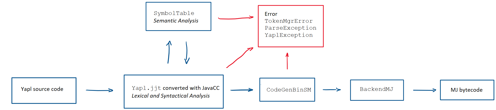

# Compiler Report
Alexander Lercher, 01560095 (Group D)

## Overall Architecture
Our compiler generates MicroJava (MJ) bytecode from YAPL source code. We did not implement the syntactic analysis on our own, but used JavaCC which automatically converts a grammar to an LL(1) parser. 
Semantic analysis and type checking were implemented ad-hoc by employing a symbol table. Similarly, code generation was triggered directly while parsing the input stream. Therefore, our compiler only needs a single pass for bytecode generation. 
 
The generated bytecode is standard MJ bytecode with its magic bytes and length information as header followed by code and then static data. Code optimization was not implemented. 

All information needed to generate the parser with JavaCC is located in `yapl.compiler.Yapl.jjt`. There, we defined the valid tokens, grammar productions, local lookaheads, and all extra code for semantic analysis and code generation.

The definition of tokens in JavaCC is needed to allow the correct matching of input. Next, we used JavaCC's syntax to define grammar productions based on the Yapl syntax. These productions resemble normal Java methods as they have a return type, a name, parameters, and *throws* declarations. Additionally, they support all operations of EBNF like alternatives, optionals, and repetition. The productions are automatically converted to working Java source files by JavaCC. The generated source code is performing the syntactical analysis. 
If a lexical or syntactical error is encountered in the input file, the compilation is aborted and a `yapl.compiler.TokenMgrError` or `yapl.compiler.ParseException` is thrown, respectively.

The semantic analysis is implemented by using the `yapl.impl.SymbolTable`. This table holds all symbols declared in the program including their scopes, kinds (e.g. procedure or variable), and data types. Every time a symbol is used, the symbol table is checked for its definition. If definition and use do not match (e.g. calling an integer variable), a `yapl.lib.YaplException` is thrown.
 
Type checking is implemented in a similar way. Depending on the grammar production certain types are required for the symbols. For instance, a *greater than* operator cannot be used with boolean variables. These checks are again executed at fitting positions in the grammar productions by either direct statements or calls to the corresponding methods in `yapl.impl.CodeGenBinSM`.

Finally, MJ bytecode is generated in the `yapl.impl.BackendMJ` if no exception occurred before this point. All operations can be added to bytecode by calling the corresponding method which will append the MJ instruction to the end of the code buffer. Missing jump addresses and procedure frame sizes are backpatched once known or during the actual bytecode generation process. This generation process will write all buffered instructions and static data to file. 
To abstract this low-level functionality, the `Yapl.jjt` exclusively uses the `CodeGenBinSM` for code generation. This will handle MJ implementation details like determining the correct assignment instruction for different symbol types (e.g. array elements and constants) behind the scenes. It will then call the backend to add the concrete instruction to the code buffer.

## Symbol Table (Functional Issue 1)
The ` SymbolTable` stores information about the symbols used in the source program. It provides the classical `addSymbol(Symbol)` and `lookup(String)` methods. Additionally, new scopes can be opened and closed with `openScope()` and `closeScope()` respectively. Identifiers are unique and can only be declared once per scope. Furthermore, using a symbol will effectively use the symbol in the nearest scope (most closely nested rule). To achieve this, the lookup method iterates through all scopes from innermost to outermost and returns the first occurrence of a symbol with the given identifier.

The `yapl.impl.YaplSymbol` used in the symbol table implements `yapl.interfaces.Symbol` and contains all information about individual symbols. 
- `kind` represents the basic type of the symbol, like a procedure, variable, constant or parameter
- `type` represents the data type, like int, bool or void
- `isReadonly` and `isGlobal` are self-explanatory and are used for constants and global variables respectively
- `offset` represents the offset in the activation record, static area or procedure parameter list
- `name` is the identifier used for the symbol

Information about the individual symbols is used for the semantic analysis. Following is a list of selected uses for the symbol table.
The compiler checks if opening and closing tags (*BEGIN*, *END*) have the same identifier in `SymbolTable.closeScope(String, boolean, int, int)`. It also checks if used symbols have the correct kind. For instance, the `checkCorrectDeclarationAsProcedure(String, int, int)` method is used in the `ProcedureCall` production of the JavaCC file.
The lookup method is used to get information about referenced/used symbols after their definition. An example is JavaCC’s production `ArrayLen` where lookup is used to get the symbol of the array identifier to pass its definition information to the code generation.
`SymbolTable.getNearestParentSymbol(int)` is used in the `ReturnStatement` production to check against the expected return data type of the encapsulating procedure.

## YAPL Data Types (FI 2)
Data types are represented by `yapl.lib.Type`. There, the basic datatypes are already represented as `Type.INT`, `Type.BOOL`, and `Type.VOID` (used as return type). Complex types are implemented as subclasses `yapl.lib.ArrayType`, `yapl.lib.ProcedureType`, and `yapl.lib.RecordType` which contain information needed for the corresponding type. An exemplary type combability check is done in the `ReturnStatement` production, where the expected return type of the encapsulating procedure is checked against the symbol to be returned. The overridden `equals(Object)` can be used for checking compability and compares
- equality for primitive types
- basetype and dim for arrays
- name, return type, and parameters (and their order) for procedures
- size and fields (and their order) for records

where used types are again checked recursively.

## Procedure Call Translation (FI 6)
Procedure calls are handled in the grammar production `ProcedureCall`.
First, the called symbol is checked for correct declaration as procedure in the symbol table and is loaded with `SymbolTable.lookup(String)`. Next, the arguments are loaded by returning a list from the production `ArgumentList`.
 
The symbol from the symbol table is used to extract more information stored in ` ProcedureType`. From here, the list of arguments defined in the procedure declaration is loaded. A `YaplException` is thrown if one of the arguments provided for the call does not match the argument given in the declaration. If the arguments match, code for the procedure call will be generated.
 
For user-defined procedures ` BackendMJ.callProc(String)` is called. Predefined procedures are handled slightly differently and will be explained in the next section. The parameter for `callProc(String)` is the label of the procedure, which was already generated when encountering its declaration. A use before declaration is not allowed with this single-pass compiler implementation. The bytecode for loading the arguments is already generated in the `Expr` production which is called inside `ArgumentList`, so nothing has to be added in `callProc(String)`.

In short, the activation record generated by the parser is the same as defined in the MicroJava documentation.
The generated bytecode contains the *call* instruction with the backpatched address for the procedure. Executing this instruction will pushes the caller's program counter on top of the stack. Next, the procedure's *enter* instruction pushes the current frame pointer on top of the stack and replaces it by the stack pointer. Now, program counter and old frame pointer are above the new frame pointer. Finally, space is reserved for all variables (size is already known at compile time) and arguments are popped from the expression stack and stored in the activation record.

## Predefined Procedures (FI 7)
Predefined procedures are inserted in the symbol table as an outermost scope, so they are available everywhere.
They are loaded from `SymbolTable.getYaplPredefinedScope()` during the SymbolTable construction `SymbolTable()`. For easier extension we created a `yapl.impl.PredefinedFunction` enum, where all four procedures are defined with name, return type and arguments.

If any call is encountered by the grammar productions, `CodeGenBinSM.callProc(Symbol, Attrib[])` is called. If the called procedure is not predefined, `BackendJM.callProc(String)` is called as explained in the previous section. Otherwise `CodeGenBinSM.callPredefinedFunction(PredefinedFunction, Attrib[])` is executed. This method will then generate bytecode conceptually equivalent to the corresponding predefined Yapl procedure. As before, the arguments for the procedure are already on top of the expression stack in correct order as code for this is generated during the production `ArgumentList`.

## Personal Contribution
As the project was rather large and could hardly be distributed between team members, we decided to work on everything as we found time. I mostly worked on code generation in `BackendMJ`, semantic analysis with the `SymbolTable`, and code generation for procedures and 1d arrays in `CodeGenBinSM`. Naturally, I also worked on `Yapl.jjt` to integrate everything.
 
Sometimes I found it hard to mix compile time and run time for code generation as I had to think in two concepts simultaneously. Furthermore, I think that our compiler could be improved a lot now that we have the experience how to build it.